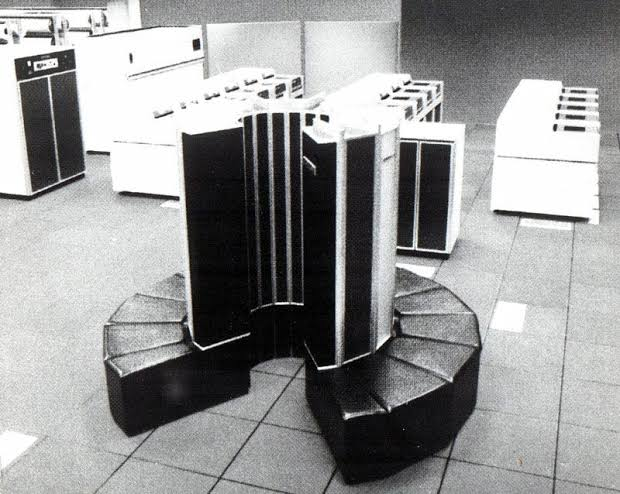

# crayon

A CPU emulator for the CRAY-1 supercomputer.

<p align="center">
  
</p>

## What it is

The CRAY-1 was designed by Seymour Cray and first installed at Los Alamos National
Laboratory in 1976. It remained the world's fastest computer until 1982. Around 80
systems were sold to government laboratories, research institutions, and universities
for up to $8 million each.

The systems were used to solve some of the hardest computational problems of the era:
simulating nuclear weapons at Los Alamos and Lawrence Livermore, forecasting global
weather by modelling movements of air masses, designing aircraft by simulating air
flows over wing and airframe surfaces, and geophysical research and seismic analysis. Despite
their different applications, these workloads all share the same structure: the same
operation applied independently across large datasets. That is exactly what the
CRAY-1 was designed to accelerate.

For example, [kepler.asm](examples/kepler.asm) computes the orbital periods of all eight planets simultaneously using vector instructions. The [nbody64.asm](examples/nbody64.asm) example computes the gravitational interactions between 64 bodies in parallel, matching the CRAY-1's 64-element vector length.

The defining feature of the CRAY-1 was its eight vector registers, each containing 64
64-bit elements. A single instruction could initiate a floating-point multiply across
all 64 element pairs, with the pipeline producing one result every clock cycle (12.5 ns)
once full. On vector workloads, the machine could produce up to 160 million floating-point results
per second: the 80 MHz clock issues one instruction per cycle, but when a vector multiply
and a vector add are chained, both functional units contribute a result on every cycle.
Programs that take advantage of the vector features can achieve substantially higher rates
than scalar implementations on the same hardware.

The machine also supported *chaining*: the output of one vector functional unit could
feed directly into another before the first operation had completed, allowing dependent
instructions to overlap in execution. The same principle is used by modern SIMD
instruction sets such as AVX-512, more than four decades later.

The CRAY-1's iconic cylindrical shape was driven by engineering constraints rather than
aesthetics. No wire inside the machine was longer than four feet — the total internal wiring
stretched to roughly 50 miles — reducing signal propagation delays and enabling a
higher clock frequency. The padded bench surrounding
the base concealed the power supplies and the Freon cooling system required to dissipate
the machine's 115 to 150 kW power consumption.

## Architecture

- **Clock**: 12.5 ns (80 MHz)
- **Memory**: up to 1M 64-bit words (8 MB), 16 interleaved banks, word-addressed
- **Registers**: 8x24-bit address (A), 8x64-bit scalar (S), 8x(64x64-bit) vector (V), plus 64 intermediate address (B) and scalar (T) registers for staging
- **Vector length/mask**: 7-bit VL register (0–64), 64-bit VM mask register
- **Instruction size**: 16-bit (one parcel) or 32-bit (two parcels); 128 opcodes
- **Floating point**: 64-bit signed-magnitude, 15-bit biased exponent, 48-bit coefficient

## Usage

```
cargo run -- <program.asm>   # assemble with the built-in Cray-1 ruleset and run
cargo run -- <program.bin>   # load a flat big-endian binary and run
cargo test
```

Programs are written in [customasm](https://github.com/hlorenzi/customasm) syntax.
The ruleset is defined in `cray1.asm` and embedded in the binary. See [examples](examples) folder.

## References

Cray Research, Inc. [*The CRAY-1 Computer System*](https://s3data.computerhistory.org/brochures/cray.cray1.1977.102638650.pdf) (1977), publication number 2240008 8.

Cray Research, Inc. [*CRAY-1 Hardware Reference Manual*](https://bitsavers.trailing-edge.com/pdf/cray/CRAY-1/2240004C_CRAY-1_Hardware_Reference_Nov77.pdf) (November 1977), publication number 2240004C.
